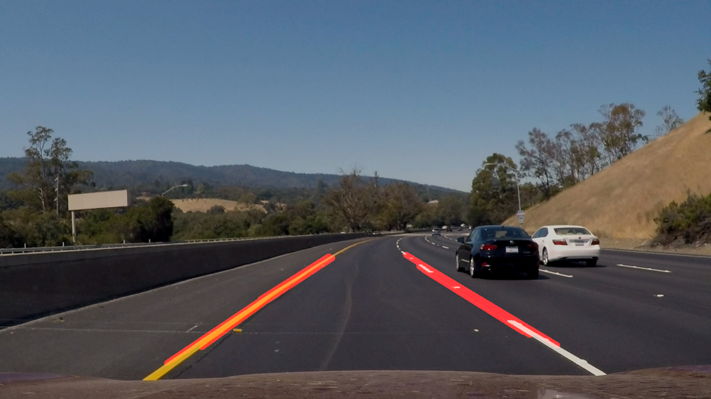
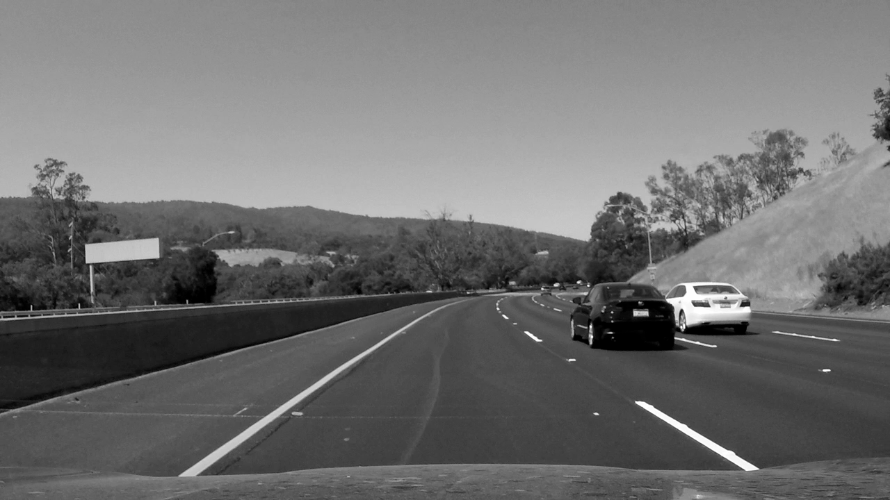
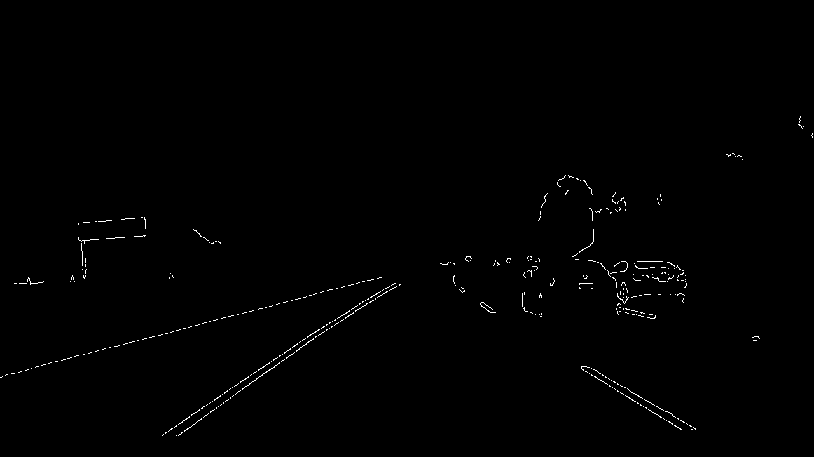
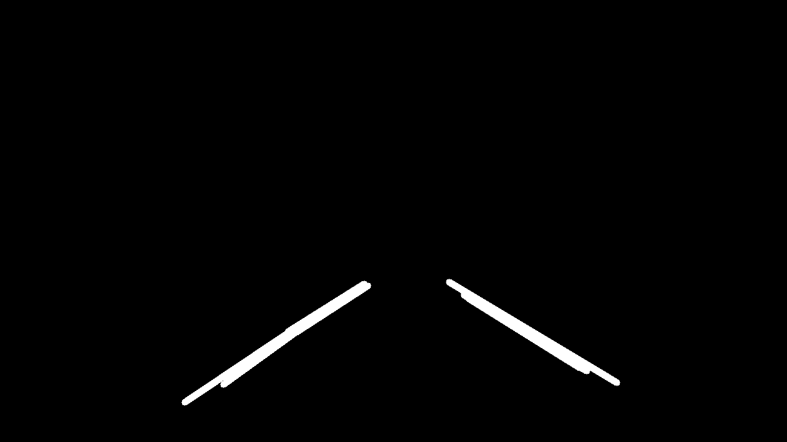

# **Finding Lane Lines on the Road** 

---

### Reflection

### 1. Pipeline.

My pipeline consisted of 5 steps.

1. Grayscale

2. Gaussian blur

3. Canny edge

4. Masked edges

5. Hough transform

 

### 2. Identify potential shortcomings with your current pipeline

One potential shortcoming would be the non-smooth changes of coefficients of linear regressor. 
That has regretfully caused the lines to be quite jumpy along with some inaccuracy.

### 3. Suggest possible improvements to your pipeline

A possible improvement would be to smoothen the changes of the coefficients by performing time-series prediction to 
assist the current observation. Clipping on the change would be helpful too.